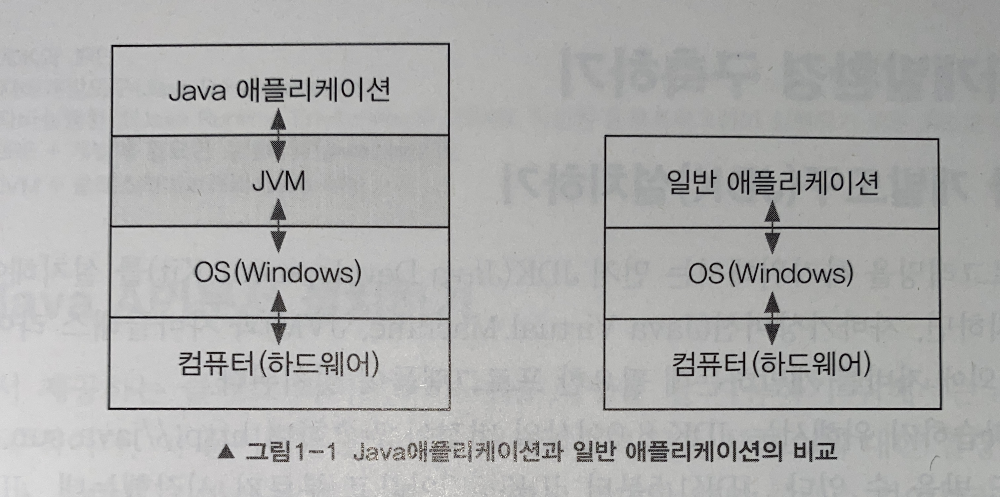
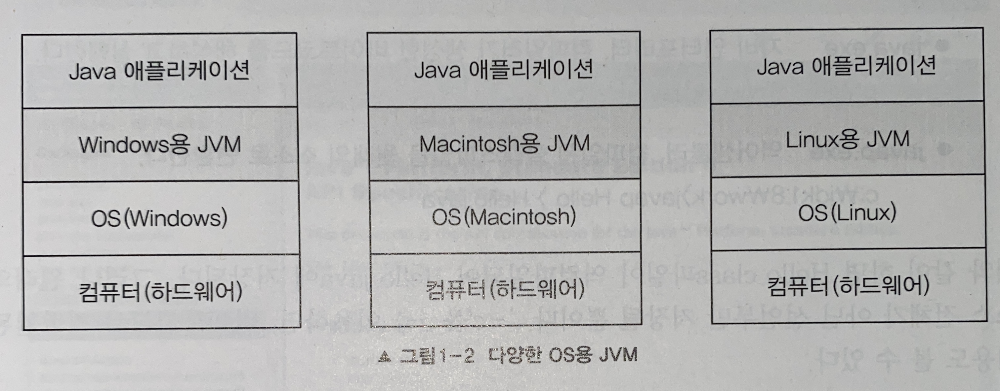

# Java_study
자바의 정석을 읽으며 공부하였습니다.

## Chapter 01

## 1. 자바

### 1.1 자바란?

자바는 썬 마이크로시스템즈에서 개발하여 1996년 1월에 공식적으로 발표한 객체지향 언어이다.

- 특징
  - 운영체제에 독립적이다.
    - 자바로 작성된 프로그램은 운영체제의 종류에 관계없이 실행이 가능하다. 운영체제에 따라 프로그램을 전혀 변경하지 않고도 실행이 가능하다.
  - 객체지향 개념과 기존의 다른 프로그래밍언 c++의 장점을 택한 동시에 잘 사용되지 않는 부분을 제외 함
  - 배우기 쉽고 이해하기 쉬운 간결한 표현 가능
  - 풍부한 클래스 라이브러리를 가짐

### 1.2 자바의 역사

자바의 역사는 1991년 썬의 엔지니어들에 의해서 고안된 오크(Oak)라는 언어에서부터 시작되었다.

제임스 고슬링과 아서 밴 호프와 같은 썬의 엔지니어들의 원래 목표는 가전제품에 탑재 될 소프트웨어를 만드는 것이었다. 처음에 C++을 확장해서 사용하려 했지만, C++로는 그들의 목적을 이루기에 판단하였다.

그래서 C++의 장점을 도입하고 단점을 보완한 새로운 언어인 Oak를 개발하였고, 처음에는 가전제품이나 소형기기에 사용될 목적이었으나 여러 종류의 운영체제를 사용하는 컴퓨터들이 통신하는 인터넷이 등장하자 운영체제에 독립적인 Oak가 이에 적합하다 판단하여, 인터넷에 적합하도록 개발 방향을 바꾸고 이름을 자바로 변경하게 되었으며, 1996년 1월에 자바의 정식버전을 발표했다.

그 당시에 자바로 작성된 애플릿은 정적인 웹페이지에 사운드와 애니메이션 등의 멀티미디어적인 요소들을 제공할 수 있는 유일한 방법이였으나, 보안상의 이유로 최신 웹브라우저에서 더이상 지원하지 않게 되었다. 대신 서버 프로그래밍을 위한 서블릿과 JSP(Java Server Pages) -> (허나 현재는 Thymeleaf도 변하는 추세다)가 더 많이 사용된다.

그리고 구글의 스마트폰 운영체제인 안드로이드에서도 Java(허나 이것도 최근에는 Kotlin으로 많이 대체되는 추세다)를 사용한다.

### 1.3 자바언어의 특징

1. 운영체제에 독립적이다.

   - 기존의 언어는 한 운영체제에 맞게 개발된 프로그램을 다른 종류의 운영체제에 적용하기위해서 많은 노력이 필요했다.

     하지만 자바는 일종의 애뮬레이터인 자바가상머신(JVM)을 통해서 운영체제에 독립적으로 실행될 수 있다. 자바 응용프로그램은 운영체제나 하드웨어가 아닌 JVM하고만 통신하고 JVM이 자바 응용프로그램으로부터 전달받은 명령을 해당 운영체제가 이해할 수 있도록 변환하여 전달한다. 자바로 작성된 프로그램은 운영체제에 독립적이지만 JVM은 운영체제에 종속적이어서 썬에서는 여러 운영체제에서 설치할 수 있는 서로 다른 버전의 JVM을 제공하고 있다.

     그래서 자바로 작성된 프로그램은 운영체제와 하드웨어에 관계없이 실행가능하다.

2. 객체지향 언어이다.

   - 자바는 프로그래밍의 대세로 자리 잡은 객체지향 프로그래밍언어(object-oriented pro-gramming language) 중의 하나로 객체지향개념의 특징인 상속, 캡슐화, 다형성이 잘 적용된 순수한 객체지향언어라는 평가를 받고있다.

3. 비교적 배우기 쉽다.

   - 자바의 연산자와 기본구문은 C++에서, 객체지향과 관련된 구문은 스몰톡이라는 객체지향언어에서 가져왔다. 이 들 언어의 장점은 취하면서 복잡하고 불필요한 부분은 과감히 제거하여 단순화함으로서 쉽게 배울 수 있으며, 간결하고 이해하기 쉬운 코드를 작성할 수 있도록 하였다. 객체지향언어의 특징인 재사용성과 유지보수의 용이성 등의 많은 장점에도 불구하고 배우기가 어렵기 때문에 많은 사용자층을 확보하지 못했으나 자바의 간결하면서도 명료한 객체지향적 설계는 사용자들이 객체지향개념을 보다 쉽게 이해하고 활용할 수 있도록 하여 객체지향 프로그래밍의 저변확대에 크게 기여했다.

4. 자동 메모리 관리(Garbage Collection)

   - 자바로 작성된 프로그램이 실행되면, 가비지 컬렉터(garbage collector)가 자동적으로 메모리를 관리해주기 때문에 프로그래머는 메모리를 따로 관리 하지 않아도 된다. 가비지 컬렉터가 없다면 프로그래머가 사용하지 않는 메모리를 체크하고 반환하는 일을 수동적으로 처리해야할 것이다. 자동으로 메모리를 관리한다는 것이 다소 비효율적인 면도 있지만, 프로그래머가 보다 프로그래밍에 집중할 수 있도록 도와준다.
     - 반례를 따지고 보면 C++ 또는 C에서는 객체를 생성하고 수동으로 동적 객체를 해줘야한다. 매우 귀찮다 너무너무 귀찮다

5. 네크워크와 분산처리를 지원한다.

   - 인터넷과 대규모 분산환경을 염두에 둔 까닭인지 풍부하고 다양한 네트워크 프로그래밍 라이브러리를 통해 비교적 짧은 시간에 네트워크 관련 프로그램을 쉽게 개발할 수 있도록 지원한다.

6. 멀티쓰레드를 지원한다.

   - 일반적으로 멀티쓰레드의 지원은 사용되는 운영체제에 따라 구현방법도 상이하며, 처리 방식도 다르다. 그러나 자바에서 개발되는 멀티쓰레드 프로그램은 시스템과는 관계없이 구현가능하며, 관련된 라이브러리가 제공되므로 구현이 쉽다. 그리고 여러 쓰레드에 대한 스케줄링을 자바 인터프리터가 담당하게 된다.

7. 동적 로딩을(Dynamic Loading)을 지원한다.

   - 보통 자바로 작성된 애플리케이션은 여러 개의 클래스로 구성되어 있다. 자바는 동적 로딩을 지원하기 때문에 실행 시에 모든 클래스가 로딩되지 않고 필요한 시점에 클래스를 로딩하여 사용할 수 있다는 장점이 있다. 그 외에도 일부 클래스가 변경되어도 전체 애플리케이션을 다시 컴파일하지 않아도 되며, 애플리케이션의 변경사항이 발생해도 비교적 적은 작업만으로도 처리할 수 있는 유연한 애플리케이션을 작성할 수 있다.

     > 참고: 자바의 단점으로는 속도문제가 가장 대표적인것인데 바이트코드를 하드웨어의 기계어로 바로 변환해주는 JIT컴파일러와 Hotsop과 같은 신기술의 도입으로 JVM의 기능이 향상됨으로써 속도문제가 상당히 개선되었다.

### 1.4 JVM(Java Virtual Machine)

JVM은 'Java virtual machine'을 줄인 것으로 직역하면 '자바를 실행하기 위한 가상 기계'라고 할 수 있다. 한국어로 쉽게 말하자면 '자바를 실행하기 위한 가상 컴퓨터'라고 이해하면 좋다.

가상 기계는 소프트웨어로 구현된 하드웨어를 뜻하는 넓은 의미의 용어이며, 컴퓨터의 성능이 향상됨에 따라 점점 더 많은 하드웨어들이 소프트웨어화 되어 컴퓨터 속으로 들어오고 있다. 그 예로는 TV와 비디오를 소프트웨어화한 윈도우 미디어 플레이어라던가, 오디오 시스템을 소프트웨어화한 윈앰프(winamp) 등이 있다.

이와 마찬가지로 '가상 컴퓨터(virtual computer)'는 실제 컴퓨터(하드웨어)가 아닌 소프트웨어로 구현된 컴퓨터라는 뜻으로 컴퓨터 속의 컴퓨터라고 생각하면된다.(요새는 VMWare의 가상머신이나 도커 같은것을 생각하면 좋을 것 같다.)

자바로 작성된 애플리케이션은 모두 이 가상 컴퓨터(JVM)에서만 실행되기 때문에, 자바 애플리케이션이 실행되기 위해서는 반드시 JVM이 필요하다.

일반 애플리케이션의 코드는 OS만 거치고 하드웨어로 전달되는데 비해 Java 애플리케이션은 JVM을 한번 더 거치기 때문에, 그리고 하드웨어에 맞게 완전히 컴파일된 상태가 아니고 실행 시에 해석되기 때문에 속도가 느리다는 단점을 가지고 있다. 그러나 요즘엔 바이트코드(컴파일된 자바코드)를 하드웨어의 기계어로 바로 변환해주는 JIT컴파일러와 향상된 최적화 기술이 적용되어서 속도의 격차를 많이 줄였다.

그림 1-1에서 볼 수 있듯이 일반 애플리케이션은 OS와 바로 맞붙어 있기 때문에 OS 종속적이다. 그래서 다른 OS에서 실행시키기 위해서는 애플리케이션을 그 OS에 맞게 변경해야 한다. 반면에 Java 애플리케이션은 JVM하고만 상호작용을 하기 때문에 OS와 하드웨어에 독립적이라 다른 OS에서 프로그램의 변경없이 실행이 가능하다. 단 JVM은 OS에 종속적이기 때문에 해당 OS에서 실행가능한 JVM이 필요하다.

그래서 썬에서는 일반적으로 많이 사용되는 주요 OS용 JVM을 제공하고 있고, 자바의 중요한 장점 중 하나인 "Write once, run anywhere(한 번 작성하면 어디서든 실행된다.)"이 가능하게 되는 것이다.

## Ch2는 JDK 설치 과정은 생략하고 주요 프로그램만 기록

- javac.exe: 자바 컴파일러이며, 자바 소스코드를 바이트코드로 컴파일한다.
- java.exe: 자바 인터프리터이며, 컴파일러가 생성한 바이트코드(클래스 파일)를 해석하고 실행한다.
- javap.exe: 역어셈블러, 컴파일된 클래스파일을 원래의 소스코드로 변환한다.

- javadoc.exe: 자동 문서 생성기, 소스파일에 있는 주석을 이용하여 Java API문서와 같은 형식의 문서를 자동으로 생성한다.

- jar.exe: 압축프로그램, 클래스파일과 프로그램의 실행에 관련된 파일을 하나의 jar파일(.jar)로 압축하거나 압축해제한다.

  > 참고 JDK와 JRE
  >
  > JDK - 자바 개발도구(Java Development Kit)
  >
  > JRE - 자바 실행환경(Java Runtime Environment) 자바로 작성된 응용프로그램이 실행되기 위한 최소 환경
  >
  > JDK = JRE + 개발에 필요한 실행파일 (javac.exe 등)
  >
  > JRE = JVM + 클래스 라이브러리(Java API)

## 3. 자바로 프로그램 작성하기

### 3.1 Hello.java

~~~java
package ch1;

public class Hello {

  public static void main(String[] args) {
    System.out.println("Hello, World");
  }
}

~~~

위 예제를 실행하려면, 먼저 자바컴파일러(javac)를 사용해서 소스파일(Hello.java)로부터 클래스파일(Hello.class)을 생성해야 한다. 그 다음 자바 인터프리터(java.exe)로 실행한다.

~~~
Hello.java 작성 -> Hello.class 생성 -> "Hellow World"출력
					  javac 컴파일     java(인터프리터) 실행
~~~

자바에서 모든 코드는 반드시 클래스 안에 존재해야 하며, 서로 관련된 코드들을 그룹으로 나누어 별도의 클래스를 구성하게 된다. 그리고 이 클래스들이 모여 하나의 Java 애플리케이션을 이룬다.

"public static void main(String[] args)"는 main 메서드의 선언부인데, 프로그램을 실행할 때 'java.exe'에 의해 호출될 수 있도록 미리 약속된 부분이다.

Main 메서드의 선언부 다음에 나오는 괄호{}는 메서드의 시작과 끝을 의미하며, 이 괄호 사이에 작업할 내용을 작성해 넣으면 된다. Java 애플리케이션은 main 메서드의 호출로 시작해서 main 메서드의 첫 문장부터 마지막 문장까지 수행을 마치면 종료된다.

모든 클래스가 main메서드를 가져고 있어야 하는 것은 아니지만, 하나의 Java 애플리케이션에는 main 메서드를 포함한 클래스가 반드시 하나는 있어야 한다. Main 메서드는 Java애플리케이션의 시작점이므로 main 메서드 없이는 Java 애플리케이션은 실행될 수 없다. 작성된 Java 애플리케이션을 실행할 때는 java.exe 다음에 main 메서드를 포함한 클래스의 이름을 적어줘야 한다.

하나의 소스파일에 하나의 클래스만을 정의하는 것이 보통이지만, 하나의 소스파일에 둘 이상의 클래스를 정의하는 것도 가능하다. 이 때 주의해야할 점은 '소스파일의 이름은 public class의 이름과 일치해야 한다.'는 것이다. 만일 소스파일 내에 public class가 없다면, 소스파일의 이름은 소스파일 내의 어떤 클래스의 이름으로 해도 상관없다.

소스파일(*.java)와 달리 클래스파일(*.class)는 클래스마다 하나씩만 만들어진다.

### 3.3 자바프로그램의 실행과정

콘솔에서 Java 애플리케이션을 실행시켰을 때

~~~sh
java Hello
~~~

진행순서

1. 프로그램의 실행에 필요한 클래스(*.class파일)을 로드한다.
2. 클래스파일을 검사한다. (파일형식, 악성코드 체크)
3. 지정된 클래스(Hello)에서 main(String[] args)를 호출한다.

## Chapter 02 변수

## 1. 변수(Variable)

- 중요한 프로그래밍 능력 중의 하나가 바로 값을 잘 다루는 것이다. 값을 저장하는 공간인 변수를 잘 이해하고 활용해야 한다.

### 1.1 변수란?

수학에서 변수를 ''변하는 수''라고 정의하지만 프로그래밍 언어세어의 변수란 값을 저장할 수 있는 메모리상의 공간을 의미한다. 

​									"변수란 단 하나의 값을 저장할 수 있는 메모리 공간"

하나의 변수에 단 하나의 값만 저장할 수 있으므로, 새로운 값을 저장하면 기존의 값은 사라진다.

### 1.2 변수의 선언과 초기화

변수를 사용하려면 먼저 변수를 선언해야한다.

~~~java
int age; //age 라는 이름의 변수를 선언
변수타입 변수이름
~~~

- `변수 타입`은 변수에 저장될 값이 어떤 '타입'인지르 지정하는 것이다. 저장하고자 하는 값의 종류에 맞게 변수의 타입을 선택하면 된다. 자바는 정수형, 실수형, 문자형 등 다양한 타입을 제공한다.
- `변수이름`은 말 그대로 변수에 뭍인 이름이다. 변수는 '값을 저장할 수 있는 메모리 공간'이므로 변수의 이름은 메모리 공간에 이름을 붙여주는 것이다. 그래야 그이름을 이용해서 저장공간(변수)에 값을 저장하고, 저장된 값을 읽어오기도 할 수 있는 것이다.
- 변수를 선언하면, 메모리의 빈공간에 `변수타입`에 알맞은 크기의 저장공간이 확보되고, 앞으로 이 저저장공간은 `변수이름`을 통해 사용할 수 있게 된다.

**변수의 초기화**

변수를 선언한 이후부터는 변수를 사용할 수 있으나, 그 전에 반드시 변수를 '초기화(initialization)'해야 한다. 메모리는 여러 프로그램이 공유하는 자원이므로 전에 다른 프로그램에 의해 저장된 '알수없는 값(쓰레기값 grabage value)'이 남아있을 수 있기 때문이다.

변수의 종류에 따라 변수의 초기화를 생략할 수 있는 경우도 있지만, 변수는 사용되기전에 적절한 값으로 초기화 하는 것이 좋다.

> 참고: 지역변수는 사용되기전에 초기화를 반드시 해야 하지만 클래스변수와 인스턴스변수는 초기화를 생략할 수 있다.

~~~
					"변수의 초기화란, 변수를 사용학기전에 처음으로 값을 저장하는 것"
~~~

### 2. 변수의 타입

**기본형과 참조형**

자료형은 크게 '기본형'과 '참조형' 두가지로 나눌 수 있다. 

- **기본형 변수**: 기본형 변수는 실제 값을 저장한다.
  - 논리형(boolean), 문자형(char), 정수형(byte, short, int, long), 실수형(float, double) 계산을 위한 실제 값을 저장한다. 모두 8개
- **참조형 변수**: 참조형 변수는 어떤 값이 저장되어 있는 **주소**를 값으로 갖는다.
  - 객체의 주소를 저장한다. 8개의 기본형을 제외한 나머지 타입

자바는 C언어와 달리 참조형 변수 간의 연산을 할 수 없으므로 실제 연산에 사용되는 것은 모두 기본형 변수이다.

> 참고: 메모리에는 1byte단위로 일련번호가 붙어있는데, 이 번호를 '메모리 주소(memory address)'또는 간단히 '주소'라고 한다. 객체의 주소는 개체가 저장된 메모리 주소를 뜻한다.

~~~java
Date today = new Date(); //Date객체를 생성해서, 그 주소를 today에 저장
~~~

객체를 생성하는 연산자 new의 결과는 생성된 객체의 주소이다. 이주소가 대입연산자에 의해서 참조 변수 today에 저장된다. 이제 참조변수 today를 통해 생성된 객체를 사용할 수 있다.

> 참고: 참조형 변수는 null 또는 객체의 주소를 값으로 갖는다(4byte). null은 어떤 객체의 주소도 저장되어 있지 않음을 뜻한다. 단 JVM이 32bit가 아니라 64 bit라면 참조형 변수의 크기는 8byte가 된다.

### 2.2 상수와 리터럴(constant & literal)

'상수'는 변수와 마찬가지로 '값을 저장할 수 있는 공간'이지만, 변수와 달리 한번 값을 저장하면 다른 값으로 변경할 수 없다.  상수를 선언하는 방법은 변수와 동일하며, 단지 변수의 타입 앞에 키워드 'final'을 붙여주기만 하면 된다.

~~~~java
final int MAX_SPEED = 10
~~~~

그리고 상수는 반드시 선언과 동시에 초기화 해야하며, 그 후부터는 상수의 값 변경을 허용하지 않는다.

**리터럴(literal)**

원래 12, 123, 3.14, 'A'와 같은 값들이 '상수'인데 프로그래밍에서는 상수를 '값을 한번 저장하면 변경할 수 없는 저장공간'으로 정의하였기 때문에 이와 구분하기위해 상수를 다른 이름으로 불러야만 했다. 그래서 상수 대신 리터럴이라는 용어를 사용한다.

~~~
변수(variable) 하나의 값을 저장하기 위한 공간
상수(constant) 값을 한번만 저장할 수 있는 공간
리터럴(literal) 그 자체로 값을 의미하는 것
~~~

~~~java
int year(변수) = 2014(리터럴);
final int MAX_VALUE(상수) = 100(리터럴);
~~~

**상수가 필요한 이유**

상수는 리터럴에 '의미있는 이름'을 붙여서 코드의 이해와 수정을 쉽게 만들기 때문에 필요하다.

## Chapter 06 객체지향 프로그래밍 1

### JVM의 메모리 구조

응용프로그램이 실행되면, JVM은 시스템으로부터 프로그램을 수행하는데 필요한 메모리를 할당받고 JVM은 이 메모리를 용도에 따라 여러 영역으로 나누어 관리한다.

- 그 중 3가지 주요 영역으로는 method area, call stack, heap이 있다.

> cv는 클래스 변수(static), lv는 지역변수 (local variable), iv(instant variable) 는 인스턴수 변수를 뜻한다.

- 메서드 영역(method area)
  - 프로그램 실행 중 어떤 클래스가 사용되면, JVM은 해당 클래스의 클래스파일(*.class)를 읽어서 분석하여 클래스에 대한 정보(클래스 데이터)를 이곳에 저장한다. 이 때, 그 클래스의 클래스변수(class variable)도 이 영역에 함께 생성된다.
- 힙(heap)
  - 인스턴스가 생성되는 공간. 프로그램 실행 중 생성되는 인스턴스는 모두 이곳에 생성된다. 즉, 인스턴스 변수들이 생성되는 공간이다.
- 호출 스택(call stack, execution stack)
  - 호출스택은 메서드의 작업에 필요한 메모리 공간을 제공한다. 메서드가 호출되면, 호출스택에 호출된 메서드를 위한 메모리가 할당되며, 이 메모리는 메서드가 작업을 수행하는 동안 지역변수(매개변수 포함)들과 연산의 중간결과 등을 저장하는데 사용된다. 그리고 메서드가 작업을 마치면 할당되었던 메모리공간은 반횐되어 비워진다.
  - 호출 스택의 특징
    - 메서드가 호출되면 수행에 필요한만큼의 메모리를 스택에 할당받는다.
    - 메서드가 수행을 마치고나면 사용했던 메모리를 반환하고 스택에서 제거된다.
    - 호출스택의 제일 위에 있는 메서드가 현재 실행중인 메서드이다.
    - 아래에 있는 메서드가 바로 위의 메서드를 호출한 메서드이다.
  - 반환 타입이 있는 메서드는 종료되면서 결과값을 자신을 호출한 메서드에게 반환한다. 대기 상태에 있던 호출한 메서드(caller)는 넘겨받은 반환값으로 수행을 계속 진행하게 된다.

### 기본형 매개변수와 참조형 매개변수

자바에서는 메서드를 호출할 때 매개변수로 지정한 값을 메서드의 매개변수에 복사해서 넘겨준다.

매개변수의 타입이 기본형(primitive type)일 때는 기본형 값이 복사되겠지만, 참조형(reference type)이면 인스턴스 주소가 복사된다.

메서드의 매개변수를 기본형으로 선언하면 단순히 저장된 값만 얻지만, 참조형으로 선언하면 값이 저장된 곳의 주소를 알 수 있기 때문에 값을 읽어 오는 것은 물론 값을 변경한느 것도 가능하다.

- 기본형 매개변수: 변수의 값을 읽기만 할 수 있다. (read only)
- 변수의 값을 읽고 변경할 수 있다. (read & write)

> 반환 타입이 `참조형`이라는 것은 메서드가 `객체의 주소`를 반환한다는 것을 의미한다.

#### 클래스 메서드와 인스턴스 메서드

- 인스턴스 메서드는 인스턴스 변수와 관련된 작업을 하는, 즉 메서드의 작업을 수해하는데 인스턴스 변수를 필요로 하는 메서드이다.
- 클래스 메서드는 인스턴스와 관계없는(인스턴스 변수나 인스턴스 메서드를 사용하지 않는) 메서드를 클래스 메서드로 정의한다.

1. 클래스를 설계할 때, 멤버변수 중 모든 인스턴스에 공통으로 사용하는 것에 static을 붙인다.

   - 생성된 각 인스턴스는 서로 독립적이기 때문에 각 인스턴스의 변수는 서로 다른 값을 유지한다. 그러나 모든 인스턴스에서 같은 값이 유지되어야 하는 변수는 static을 붙여서 클래스변수로 정의해야한다.

   

2. 클래스 변수(static 변수)는 인스턴스를 생성하지 않아도 사용할 수 있다.

   - static이 붙은 변수(클래스 변수)는 클래스가 메모리에 올라갈 때 이미 자동적으로 생성되기 때문이다.

   

3. 클래스 메서드(static 메서드)는 인스턴스 변수를 사용할 수 없다.

   - 인스턴스변수는 인스턴스가 반드시 존재해야만 사용할 수 있는데, 클래스메서드(static이 붙은 메서드)는 인스턴스 생성 없이 호출가능하므로 클래스 메서드가 호출되었을 때 인스턴스가 존재하지 않을 수도 있다. 그래서 클래스 메서드에서 인스턴스변수의 사용을 금지한다. 반면에 인스턴스변수나 인스턴스메서드에서는 static이 붙은 맴버들을 사용하는 것이 언제나 가능하다. 인스턴스 변수가 존재한다는 것은 static 변수가 이미 메모리에 존재한다는 것을 의미한다.

   

4. 메서드 내에서 인스턴스 변수를 사용하지 않는다면, static을 붙이는 것을 고려한다.

   - 메서드의 작업내용 중에서 인스턴스 변수를 필요로 한다면, static을 붙일 수 없다. 반대로 인스턴스변수를 필요로 하지 않는다면 static을 붙이자. 메서드 호출시간이 짧아지므로 성능이 향상된다. static을 안붙인 메서드는 실행 시 호출되어야할 메서드를 찾는 과정이 추가적으로 필요하기 때문에 시간이 더걸린다.

> - 클래스의 맴버변수 중 모든 인스턴스에 공통된 값을 유지해야하는 것이 있는지 살펴보고 있으면, static을 붙여준다.
> - 작성한 메서드 중에서 인스턴스 변수나 인스턴스 메서드를 사용하지 않는 메서드에 static을 붙일 것을 고려한다.

#### 가변인자와 오버로딩

기존에는 메서드의 매개변수 개수가 고정이었으나 JDK1.5부터 동적으로 지정해줄 수 있게 되었으며, 이 기능을 가변인자라고 한다.

가변인자는 **'타입... 변수명'**과 같은 형식으로 선언하며, PrintStream 클래스의 printf()가 대표적이다.

> - 가변인자를 사용한 메서드는 오버로딩을 하지않는 것이 좋다.

### 생성자

생성자란 인스턴스가 생성될 때 호출되는 '인스턴스 초기화 메서드'이다. 

- 인스턴스 변수의 초기화 작업에 주로 사용된다.
- 인스턴스 생성 시에 실행되어야 할 작업을 위해서도 사용된다.

생성자의 조건

1. 생성자의 이름은 클래스의 이름과 같아야 한다.
2. 생성자는 리턴값이 없다.

주의: **연산자 new가 인스턴스를 생성하는 것이지 생성자가 인스턴스를 생성하는 것이 아니다.**

~~~java
Card c = new Card();

1. 연산자 new에 의해서 메모리(heap)에 Card클래스의 인스턴스가 생성된다.
2. 생성자 Card()가 호출되어 수행된다.
3. 연산자 new의 결과로, 생성된 Card인스턴스의 주소가 반환되어 참조변수 c에 저장된다.
~~~

#### 생성자에서 다른 생성자 호출하기 - this(), this

같은 클래스 맴버들 간에 서로 호출할 수 있는 것처럼 생성자 간에도 서로 호출이 가능하다.

단 다음 두 조건을 만족시켜야 한다.

~~~
- 생성자의 이름을 클래스이름 대신 this를 사용한다.
- 한 생성자에서 다른 생성자를 호출할 때는 반드시 첫 줄에서만 호출이 가능하다.
~~~

#### this

`this` 는 참조변수로 인스턴스 자신을 가리킨다. 참조변수를 통해 인스턴스의 맴버에 접근할 수 있는 것처럼 'this'로 인스턴스변수에 접근할 수 있다

> **this** 인스턴스 자신을 가리키는 참조변수, 인스턴스의 주소가 저장되어 있다. 모든 인스턴스메서드에 지역변수로 숨겨진 채로 존재한다.
>
> this(), this(매개변수) 생성자, 같은 클래스의 다른 생성자를 호출할 때 사용한다.
>
> this와 this()는 비슷하게 생겼을 뿐 완전히 다른 것이다. this는 '참조 변수'이고, this()는 '생성자'이다.
>
> 다시 명심하자 생성자는 인스턴스를 생성하는 것이 아닌 인스턴스를 생성할 때 호출되는 초기화 메서드일 뿐이다. 그러므로 this()를 호출해도 생성자를 생성하는게 아니라 단순히 메서드를 호출하는 것일 뿐이다.

### 변수의 초기화

#### 초기화 블럭

초기화 블럭에는 `클래스 초기화 블럭` 과 `인스턴스 초기화 블럭` 두 가지 종류가 있다. 클래스 초기화 블럭은 클래스변수의 초기화에 사용되고, 인스턴스 초기화 블럭은 인스턴스 변수의 초기화에 사용된다.

>**클래스 초기화 블럭:** 클래스 변수의 복잡한 초기화에 사용된다.
>
>**인스턴스 초기화 블럭:** 인스턴스변수의 복잡한 초기화에 사용된다.

초기화 블럭 내에는 메서드 내에서와 같이 조건문, 반복문, 예외처리구문 등을 자유롭게 사용할 수 있다.

## Chapter 07 객체지향 프로그래밍 2

### 상속

#### 상속의 정의와 장점

상속이란, 기존의 클래스를 재사용하여 새로운 클래스를 작성하는 것이다. 상속을 통해서 클래스를 작성하면 보다 적은 양의 코드로 새로운 클래스를 작성할 수 있고 코드를 공통적으로 관리할 수 있기 때문에 코드의 추가 및 변경이 매우 용이하다.

상속 관계에 있어, 상속을 해주는 클래스를 `조상 클래스` 라 하고 상속을 받는 클래스를 `자손 클래스` 라 한다.

> **조상 클래스** 부모(parent) 클래스, 상위(super) 클래스, 기반(base) 클래스
>
> **자손 클래스** 자식(child) 클래스, 하위(sub) 클래스, 파생된(derived) 클래스

조상 클래스가 변경되면 자손 클래스는 영향을 받게 되지만, 자손클래스가 변경된는 것은 조상 클래스에 아무런 영향을 주지 못한다.

자손 클래스는 조상 클래스의 모든 맴버를 상속 받으므로 항상 조상 클래스보다 같거나 많은 맴버를 같는다.

상속을 받는다는 것은 조상 클래스를 확장(extends)한다는 의미로 해석할 수도 있으며 이것이 상속에 사용되는 키워드가 `extends`인 이유이기도 하다.

~~~
- 생성자와 초기화 블럭은 상속되지 않는다. 맴버만 상속된다.
- 자손 클래스의 맴버 개수는 조상 클래스보다 항상 같거나 많다.
~~~

> 참고: 접근 제어자가 private 또는 default인 멤버들은 상속되지 않는다기 보다 상속은 받지만 자손 클래스로부터의 접근이 제한되는 것이다.

~~~
자손 클래스의 인스턴스를 생성하면 조상클래스의 맴버와 자손 클래스의 맴버가 합쳐진 하나의 인스턴스로 생성된다.
~~~

### 오버라이딩(overriding)

#### 오버라이딩이란?

오버라이딩이란 조상 클래스로부터 상속받은 메서드의 내용을 변경하는 것을 오버라이딩이라고 한다. 

자식 클래스에서 상속받은 메소드를 그대로 사용하기도 하지만, 자신에 맞게 변경해야 하는 경우가 많다. 이럴 때 조상의 메서드를 오버라이딩 한다.

~~~java
class Parent {
	protected void hello() {
		System.out.println("hello");
	}
}

-------------------------------------------

class Child extends Parent {
	@Override
	public void hello() {
		System.out.println("hello Child");
	}
}
~~~

#### 오버라이딩의 조건

자손 클래스에서 오버라이딩 하는 메서드는 조상 클래스의 메서드와

- **이름이 같아야 한다.**
- **매개변수가 같아야 한다.**
- **반환타입이 같아야 한다.**

조상 클래스의 메서드를 자손 클래스에서 오버라이딩 할 때

1. **접근 제어자를 조상 클래스의 메서드보다 좁은 범위로 변경할 수 없다.**
   - ex: public -> private으로 오버라이딩 불가능
2. **예외는 조상 클래스의 메서드보다 많이 선언할 수 없다.**
   - ex: `부모 메소드() throws IOException{}` -> `자식 메소드() throws IOException, RuntimeException{}` 불가능 또는 `자식 메소드() throws Exception{}` 불가능

3. **인스턴스메서드를 static메서드로 또는 그반대로 변경할 수 없다.**

#### super

super는 자손 클래스에서 조상 클래스로부터 상속받은 맴버를 참조하는데 사용되는 참조 변수이다.

조상 클래스로부터 상속받은 맴버도 자손 클래스 자신의 맴버이므로 super 대신 this를 사용할 수 있다. 하지만 조상 클래스의 맴버와 자손 클래스의 맴버가 중복 정의되어 서로 구별해야 하는 경우에만 super를 사용하는 것이 좋다.

모든 인스턴스 메서드에는 자신이 속한 인스턴스의 주소가 지역변수로 저장되어 있는데, 이것이 참조변수인 this와 super의 값이 된다.

static 메서드는 이슨턴스와 관령니 없다. 그래서 this와 마찬가지로 super 역시 static 메서드에는 사용할 수 없고 인스턴스 메서드에만 사용할 수 있다.

조상 클래스에서 선언된 멤버변수와 같은 이름의 멤버변수를 자손 클래스에서 중복해서 정의하는 것이 가능하며 참조변수 super를 이용해서 서로 구별이 가능하다. 

또한 변수 뿐만 아니라 메서드 역시 super를 써서 호출할 수 있다.

#### suepr() - 조상 클래스의 생성자

this()와 마찬가지로 super() 역시 생성자이다. this()는 같은 클래스의 다른 생성자를 호출하는 데 사용되지만, super()는 조상클래스의 생성자를 호출하는데 사용된다.

### package와 import

#### 패키지(package)

패키지란 클래스의 묶음이다. 패키지에는 클래스 또는 인터페이스를 포함시킬 수 있으며, 서로 관련된 클래스들끼리 그룹 단위로 묶어 놓음으로써 클래스를 효율적으로 관리할 수 있다. 

같은이름의 클래스 일지라도 서로 다른 패키지에 존재하는 것이 가능하므로, 자신만의 패키지 체계를 유지함으로써 다른 개발자가 개발한 클래스 라이브러리의 클래스와 이름이 충돌하는 것을 피할 수 있다.

**클래스가 물리적으로 하나의 클래스파일(xxx.class)인 것과 같이 패키지는 물리적으로 하나의 디렉토리이다.** 그래서 어떤 패키지에 속한 클래스는 해당 디렉토리에 존재하는 클래스파일(.class)이어야 한다.

디렉토리가 하위 디렉토리를 가질 수 있는 것처럼, 패키지도 다른 패키지를 포함할 수 있으며 **점(.)**으로 구분한다.

- 하나의 소스파일에는 첫 번째 문장으로 단 한 번의 패키지 선언만을 허용한다.
- 모든 클래스는 반드시 하나의 패키지에 속해야 한다.
- 패키지는 점(.)을 구분자로 하여 계층구조로 구성할 수 있다.
- 패키지는 물리적으로 클래스 파일(.class)을 포함하는 하나의 디렉토리이다.

패키지를 선언하는 것은 아주 간단하다.

~~~java
package 패키지명;
~~~

#### import문

import문의 역할은 컴파일러에게 소스파일에 사용된 클래스의 패키지에 대한 정보를 제공하는 것이다.

컴파일 시에 컴파일러는 import문을 통해 소스파일에 사용된 클래스들의 패키지를 알아 낸 다음, 모든 클래스이름 앞에 패키지명을 붙여 준다.
